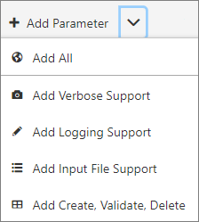
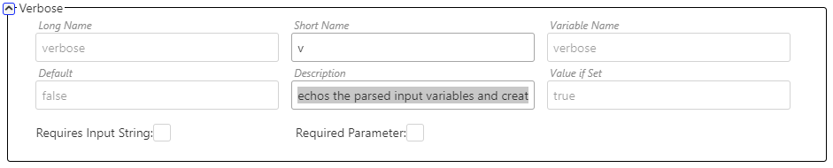
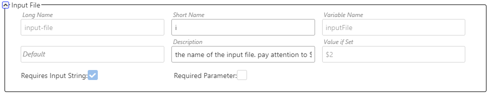

# Bash Wizard
JavaScript.  TypeScript. Node.  C#.  Visual Basic. PowerShell.

All Great.

But sometimes you just need a simple bash script. And when you do, it can be difficult to bootstrap a robust and well written script that meets some minimum expectations level.

This is where Bash Wizard comes in handy. Bash Wizard is a Windows Application that generates Bash scripts based upon "parameters" that are entered into the tool. The features supported by Bash Wizard are:

1. For each parameter a default can be specified and the variable is declared in the script
2. creates EchoInfo, EchoWarning, EchoError functions to enable colorizing output
3. Creates an Usage() function that tells the user how to use the script
4. Creates an EchoInput() function that will be called by the script to show the user what parameters were passed in
5. Parses the command line and sets the appropriate variable based on what was passed in
7. Verifies that all required parameters have been passed in and errors out if not.
8. Has built in support to load input from a JSON input file.


   => the tool will also generate the JSON file for you

9. Has built in support to create a tee so that all output is captured in a log file, which will be created for you based on a passed in log directory
10. Generates the JSON file for the Bash Debug Extension in Visual Studio Code
11. a Verbose parameter is supported

There are 4 different versions of the Bash Wizard

1. in https://github.com/joelong01/Bash-Wizard there is a Windows Store application.
2. also in https://github.com/joelong01/Bash-Wizard is a command line tool writting in .NET Core/Standard
3. https://github.com/joelong01/BashWizard is a React Web application
4. https://github.com/joelong01/BashWizard also creates an Electron app that will generate a rich client that will run on Windows, MacOS, and Linux.

the screen shots in this document are from the Electron version of the application.


# Dependencies

Bash Wizard has two dependencies

1. JQ is used to parse JSON.  see https://stedolan.github.io/jq/download/.
2. GETOPT is used to parse the command line.  Bash Wizard needs the GNU version and the Mac version is not compatible. There is built in support to automatically install the correct GETOPT using brew.   On FreeBSD, install misc/getopt.

# Electron Bash Wizard User Interface
.

1. New Script: creates a new Bash Wizard File and resets the state of the applicaiton
2. Refresh:
    a) if the Bash Script Tab has focus, this will parse the Bash Script to get the Script Name, Description, and Parameter List.  Then it will generate the latest version of a Bash Script and update teh Bash Script Tab.  User Code is preserved.
    b) if the JSON Tab has focus, this will parse the JSON  to get the Script Name, Description, and Parameter List.  Then it will generate the latest version of a Bash Script and update teh Bash Script Tab.  User Code is NOT preserved.
3. Add Parameter:  adds a default custom parameter or one of the built in parameters
4. Delete Parameter: deletes the seleted Parameter
5. Expand All: shows all of the details of each parameter
6. Collapse All: reduces the displayed information for each parameter
7. Light/Dark Mode: picks one of the two UI themes supported by Bash Wizard
8. ?:  opens this file in a browser window

The Electron version of the App has two additional features beyond the standard Electron features and the normal File IO features:

1. Auto Save: if this is selected, the Bash Script will be saved whenever it is modified.  If you are editing the script in the Bash Script tab, there will be a small delay before saving.
2. Auto Load: if this is selected, the Bash Script will automatically load whenever the file is modified outside of the Bash Wizard.  Whenever a file is opened, it goes through the Refresh process - so the file will parsed and validated.  Any parse errors will be displayed in the Messages Tab.

# Using Bash Wizard

There are 3 main scenarios for using Bash Wizard

1. Starting Fresh
2. Opening an existing Bash File
3. Starting with JSON

## Starting Fresh

The easiest way to use Bash Wizard is to simply click on

.

If you just click on the button you'll get a "Custom" parameter like this one:


The corner button on the parameter item will collapse or expand the parameter so you can show more parameters on the screen.  The name following the button ("Custom") in the above example is the type of Parameter - "Custom" being one you have entered and anything else being a special "Built In" Parameter.

Each Parameter has the following fields

- Long Name: the name of the parameter that is passed to the script with "--". This typically means something to the human using the script, like "long-parameter".  Do not put the "--" in this field.
- Short Name: the name of the parameter that is passed to the script with "-". This is typically one letter, like "l"
- Variable Name: the name the script will use as its variable.  As such it must follow the Bash variable naming convention.
- Default: the value the variable is set to when it is declared.  NOTE:  if a default is set, it cannot be a Required Parameter (because it's value is never empty)
- Description: used in the Usage() function to tell the user what this parameter is for
- Value If Set: used when parsing the input. If the value is passed in from the command line, this should be set to $2.
- Requires Input String:  if Checked, then Value If Set must be $2. If not checked, then Value if set **cannot** be $2.  Bash Wizard enforces this rule.
- Required Parameter: if Checked, the generated script will call the Usage() function and exit if the parameter's value is empty (e.g if [[ -z $myVar ]]

Bash Wizard has some functionality for catching errors when entering parameters.

1.  Long Names and Short Names can never overlap.  So if you enter a parameter with the same Long Name or Short Name as another parameter you'll get the following in the "Messages" tab:


You can click on the error to select the parameter that has the problem.

2. You will get the second error if Variable Names are reused.  You must fix these Validation Errors before running your Bash Script, as the script will not run correctly otherwise.
3. all parameter items are trimmed of whitespace before being used
4. parameters cannot start with "-"

Another typical pattern is for optional flag parameters.  The recommended way to do this is to set the default to false (which makes it non Required) and then set the "Value if Set" to true.
See the "Create, Verify, Delete Pattern" in the Optional Features section below for an example of how to do this, both in the tool and in the Bash Script.

## Opening an Existing Bash File

Bash Wizard can open a Bash file and parse it looking for the Bash Wizard code to generate the Parameter List. Opening a script that started "Starting Fresh" scenario is the normal case.

  1. Do not manually modify Bash Wizard code.  Not only might it break parsing, but it will be replaced every time Bash Wizard runs.
  2. **All** code that you write should be between these two comments:

        ```bash
        # --- BEGIN USER CODE ---

        # --- END USER CODE ---
        ```

As long as you stick to these rules, you will be able to load, modify, and save your Bash scripts.

When editing in the Electron version of the application, you can Open, Save, and Save As the bash script that you are creating.  To save the the JSON files, select all, copy, and then paste them into your favorite text editor.

Bash Wizard will also watch for file change notifications on the file you have opened or saved.  The the file changes outside Bash Wizard, then you will be prompted to load the file (File => Auto Load in the menu is a setting that will load the changed file without prompting).  You can also chose File => Auto Save and the tool will auto save the file whenever you modify a parameter, the script name, or the description.  It will also periodically save the bash file if you edit the fire directly in "Bash Script" tab.

If there is an error parsing the Bash Script, there will be an entry on the message list.

If you have an error message from parsing the Bash Script, fix it and then hit Refresh again to make the error go away.

You can also copy and paste a script into the Bash Script text box and then hit the Refresh button, which will parse the script and then regenerate it back into the Bash Script text box.  This is useful when upgrading the Bash Wizard version.


## Starting with JSON

If you select the JSON tab


you can copy or paste in the JSON format of the parameters.  If you edit the JSON in Bash Wizard, you can click on the Refresh button while the JSON tab is visible and Bash Wizard will

1. Parse the Bash Script in case you have changed it by typing in the Bash Script text box
2. Parse the JSON, creating the Parameters, File Name, and Description
2. Generate the Bash Scripts

This feature is useful if you'd rather use a text editor to create your Parameters and the UI or if you have a default set of parameters that you typically use, you can save the JSON for them
(File Open, Save, Save As are all context sensitive) and use it as a starting position.

## Built in Parameters
If you click on the down arrow, you'll get a menu of options for adding built in parameters:



The parameters will be created in the "Collapsed" state. The short name and the description are editable, but all other parameter values are read only.

Bash Wizard will auto-generate a short name based on the other parameters in the script. If no short name can be auto-generated, this setting will be left blank.

#### Add Verbose Support


Echos the parsed input variables and creates a $verbose variable to be used in user code.  In addition to the standard features that every parameter gest, the following lines are added to your script when this option is set

```bash
 if [[ $"verbose" == true ]];then
        echoInput
    fi
```
You can follow this pattern in your own code to output additional information when --verbose is set.

#### Add Logging Support

This will add the a parameter to your script and then generate a log file name based on your Script File Name and the passed in log directory. Then it will surround your user code with a tee so that all echo lines are captured in the log file.   In addition to the standard features that every parameter gest, the following lines before the user code are added to your script when this option is set (for a script with Script Name of "scriptName.sh"):
```bash
#logging support
declare LOG_FILE="${logDirectory}scriptName.sh.log"
{
    mkdir -p "${logDirectory}"
    rm -f "${LOG_FILE}"
} 2>>/dev/null
#creating a tee so that we capture all the output to the log file
{
    time=$(date +"%m/%d/%y @ %r")
    echo "started: $time"
```

and these lines are added after the user code:

```bash
 time=$(date +"%m/%d/%y @ %r")
    echo "ended: $time"
} | tee -a "${LOG_FILE}"
```
Note that Bash Wizard will enforce that the default value for logging support ends with with a "/"

#### Input File Support

This will add a parameter to your script (Long Name: input-file) and generate code to parse a JSON file using jq to pull out the variable values.  As an example, you might have a script that creates an Azure Resource Group whose usage function looks like

```bash
function usage() {
    echoWarning "Parameters can be passed in the command line or in the input file. The command line overrides the setting in the input file."
    echo "creates an Azure Resource Group"
    echo ""
    echo "Usage: $0  -r|--resource-group -g|--log-directory -l|--data-center-location -i|--input-file -v|--verify -c|--create -d|--delete " 1>&2
    echo ""
    echo " -r | --resource-group           Optional     Azure Resource Group"
    echo " -g | --log-directory            Optional     directory for the log file. the log file name will be based on the script name"
    echo " -l | --data-center-location     Optional     the location of the VMs"
    echo " -i | --input-file               Optional     filename that contains the JSON values to drive the script. command line overrides file"
    echo " -v | --verify                   Optional     if set will verify that the resource group is created"
    echo " -c | --create                   Optional     creates the resource"
    echo " -d | --delete                   Optional     deletes the resource group"
    echo ""
    exit 1
}
```

the input file in in the "Input JSON" tab, and would look like
```json
{
    "createResourceGroup.sh": {
        "resource-group": "myResourceGroup",
        "log-directory": "\"../Logs/\"",
        "data-center-location": "westus2",
        "input-file": "",
        "verify": "false",
        "create": "false",
        "delete": "false"
    }
}
```
 An example of using input-file would be
```bash
./createResourceGroup --input-file ./inputFile.json
```

Any parameter on the command line overrides what is in the file -- e.g.
```bash
./createResourceGroup --input-file ./inputFile.json --data-center-location eastus
```

would create a ResourceGroup in "eastus" eventhough the config file said to create it in "westus2".

#### Create, Validate, Delete Pattern

This will add three optional parameters to your script (long names: create, validate, delete) and then the following code to the user code section of the script:

```bash
   # --- BEGIN USER CODE ---
    function onVerify() {

    }
    function onDelete() {

    }
    function onCreate() {

    }

    #
    #   the order matters - delete, then create, then verify
    #

    if [[ $delete == "true" ]]; then
        onDelete
    fi

    if [[ $create == "true" ]]; then
        onCreate
    fi

    if [[ $verify == "true" ]]; then
        onVerify
    fi
    # --- END USER CODE ---
```

This is a useful pattern to use when your script is creating a resource somewhere. For example, if your script is creating an Azure Resource Group, then you might have code that looks something like:

```bash
    # --- BEGIN USER CODE ---
	function onVerify() {
        exists=$(az group exists --name "$resourceGroup" | jq .)
        if [[ "$exists" == false ]]; then
            echo "$resourceGroup does not exist!"
        else
            echo "$resourceGroup does exist!"
            echo "PASS"
            exit
        fi

    }
    function onDelete() {
        echo "deleting resource group $resourceGroup"
        az group delete -n "$resourceGroup" --yes

    }
    function onCreate() {
        exists=$(az group exists --name "$resourceGroup" | jq .)
        if [[ "$exists" == false ]]; then
            echo "group does not exist, creating $resourceGroup in $dataCenterLocation"
            rgInfo=$(az group create --location "$dataCenterLocation" --name "$resourceGroup")
            echo "finished creating resource group"
            echo "id: $rgInfo | jq .id"
        else
            echo "resource group already exists.  no action taken."
        fi

    }

    #
    #   the order matters - delete, then create, then verify
    #

    if [[ $delete == "true" ]]; then
        onDelete
    fi

    if [[ $create == "true" ]]; then
        onCreate
    fi

    if [[ $verify == "true" ]]; then
        onVerify
    fi
    # --- END USER CODE ---
```
Doing it this way allows you got call a "createAzureResourceGroup.sh" script with something like:

```bash
	./createAzureResourceGroup.sh -cvd
```
(other parameters left off for brevity) which will first delete the Resource Group if it exists, then create it, then verify it.  You can also call it with just
```bash
	./createAzureResourceGroup.sh -cv
```
which will create it and then verify it exists.  Or simply "test mode" which would be
```bash
	./createAzureResourceGroup.sh -v
```

which only calls the verify function.

#### Bash Debugging

Visual Studio Code has an extension for debugging Bash Scripts: https://marketplace.visualstudio.com/items?itemName=rogalmic.bash-debug

This has proven to be incredibly useful and it is highly recommended.  To use the extension in VS Code, you have to create a debug configuration.  To make this easier, Bash Wizard has has the "VS Code Debug Config" tab which can be copied and pasted into the VS Code debug config.  It is often easiest to have a debug setting per file and in the config pass only the --input-file setting.


```json
{
    "type": "bashdb",
    "request": "launch",
    "name": "Debug createResourceGroup.sh",
    "cwd": "${workspaceFolder}",
    "program": "${workspaceFolder}//createResourceGroup.sh",
    "args": [
        "--resource-group",
        "",
        "--log-directory",
        "../Logs/",
        "--data-center-location",
        "westus2",
        "--input-file",
        "../Data/cseAzureAutomationConfig.json",
        "--verify",
        "false",
        "--create",
        "false",
        "--delete",
        "false",
    ]
}

```

Edit the JSON to remove parameters you don't care about.
